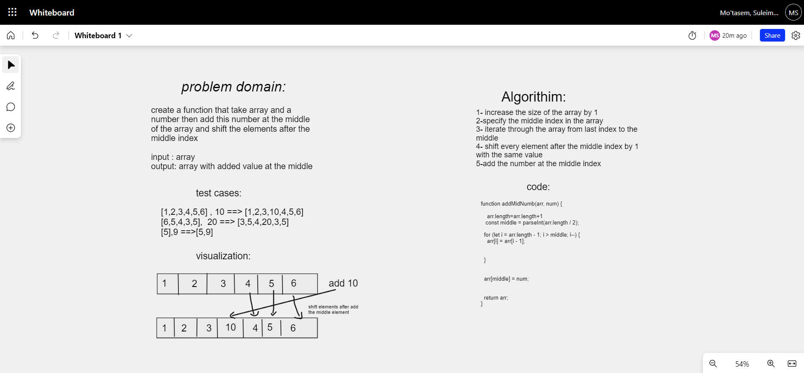

## array-insert-shift

## Summary

insert value at the middle of the array and shift the elements after the middle index

## Whiteboard Process

## Solution

function addMidNumb(arr, num) {

    arr.length=arr.length+1

const middle = parseInt(arr.length / 2);

for (let i = arr.length - 1; i > middle; i--) {
arr[i] = arr[i - 1];

}

arr[middle] = num;

return arr;
}
