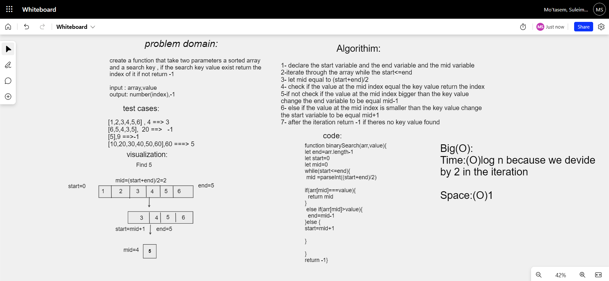

# Binary Search 

find the element in sorted array , if exist return the index of the element if not return -1 




## Solution 
```javascript 
function binarySearch(arr,value){
let end=arr.length-1
let start=0
let mid=0
while(start<=end){
 mid =parseInt((start+end)/2)

if(arr[mid]===value){
  return mid
}
 else if(arr[mid]>value){
  end=mid-1
}else {
start=mid+1
  
}
  
}
return -1}
```