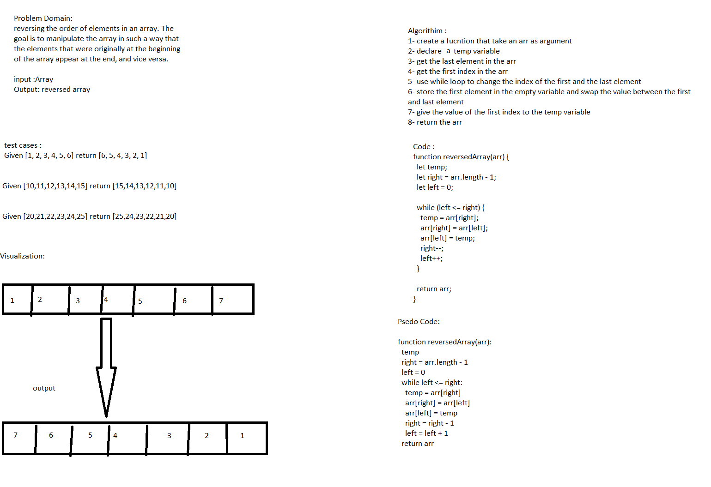

# Challenge Title
## Reverse Array

## Summary
Reverse array without using built in functions

## Whiteboard Process

## link to code 

## Approach 
the approach used in this code is to swap the first and last elements in the array then move the pointer to another elements to do the same step 

## Solution

function reversedArray(arr) {
  let temp;
  let right = arr.length - 1;
  let left = 0;

  while (left <= right) {
    temp = arr[right];
    arr[right] = arr[left];
    arr[left] = temp;
    right--;
    left++;
  }

  return arr;
}

## Unit tests written and passing

[1, 2, 3, 4, 5, 6] ----> [6,5,4,3,2,1]

[89, 2354, 3546, 23, 10, -923, 823, -12] ----> [-12, 823, -923, 10, 23, 3546, 2354, 89]