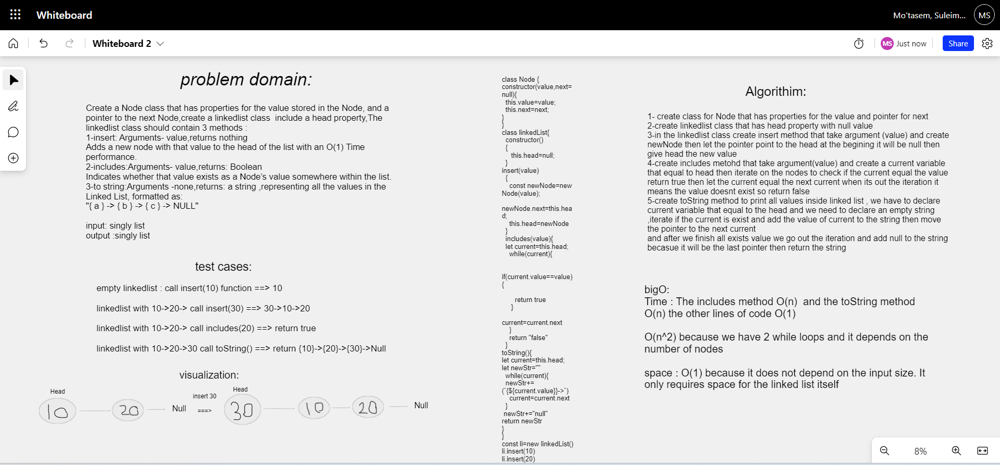

# Linked List 

## Summary

create Node class with value and next properties , create linkedlist class with head property
inside linkedlist class create 3 methods :
1-insert : it will insert value to the head 
2-includes : check if the value is exist 
3-toString : print all valuse .

## whiteboard



## Solution
```javascript
class Node {
constructor(value,next=null){
  this.value=value;
  this.next=next;
}
}
class linkedList{
  constructor()
  {
     this.head=null;
  }
insert(value)
  {
    const newNode=new Node(value);
    newNode.next=this.head;
    this.head=newNode
  }
  includes(value){
  let current=this.head;
    while(current){
      
     if(current.value==value){
      
       return true
     }
       current=current.next
    }
    return "false"
  }
toString(){
let current=this.head;
let newStr=""
  while(current){
  newStr+=(`{${current.value}}->`)
    current=current.next
  }
 newStr+="null"
return newStr
}
}
const li=new linkedList()
li.insert(30)
li.insert(20)
li.insert(10)
console.log(li.includes(20))
console.log(li.toString())
console.log(li)

```